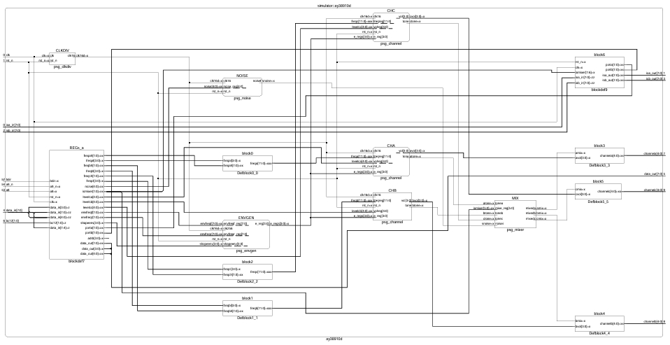

# AY-3-8910 - Programable Sound Generator (PSG)

> [!CAUTION] Disclaimer: 
> This implementation may not fully replicate full behavior of the original AY-3-8910. If you want fully replication of the original AY-3-8910, contact me. Use at your own risk.

This repository contains a Verilog implementation of the AY-3-8910 Programmable Sound Generator (PSG), commonly used in MSX computers and other retro systems. The AY-3-8910 is a classic sound chip that generates audio signals with three channels, noise generation, and envelope control.

## Overview

The AY-3-8910 PSG is a versatile sound chip that was widely used in 8-bit computers and gaming consoles. This Verilog implementation aims to replicate the functionality of the original hardware, providing a synthesizable IP core that can be used in FPGA-based retro systems or other projects.

## Features

- **Three Tone Generators**: Each channel can generate square waves with programmable frequency.
- **Noise Generator**: A pseudo-random noise generator for sound effects. The implementation in this repository it's not the same of the AY-3-8910, this will be exclusive for the payed version of the IP.
- **Envelope Generator**: Programmable envelope shapes for dynamic volume control.
- **Mixer Control**: Individual control for tone, noise, and envelope on each channel.
- **I/O Ports**: Simulated I/O ports for communication with the host system.

## Diagram



## Repository Structure

- /rtl - Verilog source files for the PSG core.
- /testbench - Testbench files for simulation. (soon)
- /docs - Documentation and references. (soon)
- /scripts - Scripts for simulation. (soon)

## Usage

### Simulation

To simulate the design, use your preferred Verilog simulator (e.g., ModelSim, Verilator, or Icarus Verilog). A testbench is provided in the `/testbench` directory to verify the functionality of the PSG.

```bash
# Example using Icarus Verilog
iverilog -o psg_sim -s psg_tb rtl/*.v testbench/psg_tb.v
vvp psg_sim
```

### Synthesis
The Verilog code is designed to be synthesizable for FPGA platforms. Use your preferred synthesis tool (e.g., Xilinx Vivado, Intel Quartus) to synthesize the design for your target hardware.

### References
- AY-3-8910 Datasheet

## Contributing
Contributions are welcome! If you find any issues or have suggestions for improvements, please open an issue or submit a pull request.

## License
This project is licensed under the Creative Commons
Attribution-NonCommercial-NoDerivatives 4.0 (CC-NC-ND) License.


